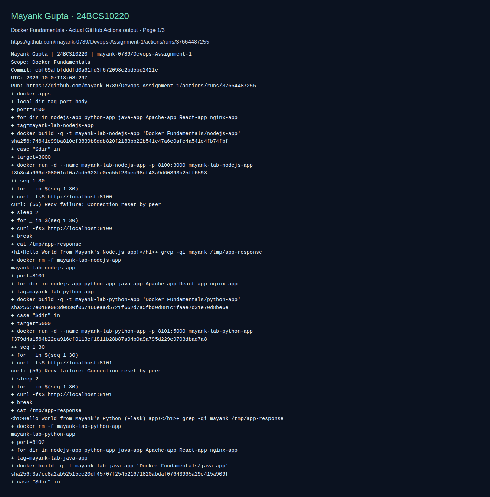

# Six containerized Hello World applications

**Name:** Mayank Gupta
**Roll No:** 24BCS10220
**Repository:** [mayank-0789/Devops-Assignment-1](https://github.com/mayank-0789/Devops-Assignment-1)

## What this lab contains

Build/run/HTTP smoke checks of Node.js, Flask, Java, Apache, React and Nginx.

Top-level resources: `Apache-app`, `React-app`, `java-app`, `nginx-app`, `nodejs-app`, `python-app`.

[Detailed adapted walkthrough](REFERENCE.md) · [Source provenance](../SOURCE.md) · [Validation scope](../VALIDATION.md)

The walkthrough retains source example commands and outputs for study. Its historical screenshots were omitted. Workflow names and completion claims in that reference describe the source design; the active workflow in this repository is `.github/workflows/validate-labs.yml`.

## Run the lab

Run these commands from this folder. Use a disposable lab environment. Linux commands need a Linux host; Docker commands need a running Docker engine; Kubernetes/Helm commands need a reachable cluster.

```bash
docker build -t mayank-nodejs-app nodejs-app
docker run --rm -p 3000:3000 mayank-nodejs-app
# Open http://localhost:3000. See REFERENCE.md for the other five apps.
```

## Fresh execution evidence

The **basics** job in [Validate Mayank DevOps labs](https://github.com/mayank-0789/Devops-Assignment-1/actions/workflows/validate-labs.yml) executes the scope above. The screenshot shows actual recorded CI commands/output; it proves only those checks.



[All screenshot pages](screenshots/) · [Full raw command output](screenshots/validation.log) · [Commit and run metadata](screenshots/validation.json)
