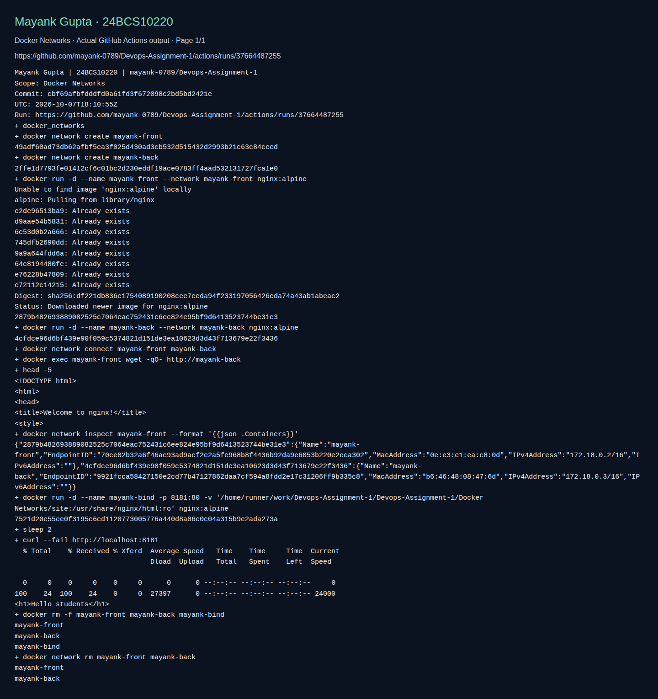

# Docker Networking & Volumes - Homework

> Adapted lab walkthrough for Mayank Gupta (24BCS10220). Commands and output blocks below are reference examples from the source material, not a claim that this machine ran them. Imported screenshots were omitted. See [source provenance](../SOURCE.md).


Practice of Docker container networking, host network, bind mounts, and overlay networks.

## Task 1: Docker Container Networking

Created 3 containers (frontend, backend, database) across 3 networks, with the **backend
connected to multiple networks** so it can bridge the frontend and the database.

| Container | Image | Network(s) |
|---|---|---|
| frontend | nginx:alpine | frontend-net |
| backend | nginx:alpine | backend-net + frontend-net + db-net |
| database | mysql:8.0 | db-net |

### Create 3 networks
```bash
docker network create frontend-net
docker network create backend-net
docker network create db-net
docker network ls
```

### Create the 3 containers
```bash
docker run -d --name frontend --network frontend-net nginx:alpine
docker run -d --name database --network db-net -e MYSQL_ROOT_PASSWORD=rootpass mysql:8.0
docker run -d --name backend  --network backend-net nginx:alpine
```

### Add the backend to 2 more networks
```bash
docker network connect frontend-net backend
docker network connect db-net backend

docker inspect backend --format '{{range $n,$v := .NetworkSettings.Networks}}{{$n}} {{end}}'
# backend-net db-net frontend-net
```

### Check connectivity
```bash
# backend -> frontend (shared frontend-net): SUCCESS
docker exec backend wget -qO- http://frontend | head -n 5   # returns nginx welcome page

# backend -> database (shared db-net): SUCCESS
docker exec backend nc -z database 3306; echo "exit code: $?"    # exit code: 0

# frontend -> database (different networks): FAILS (isolated)
docker exec frontend nc -z database 3306; echo "exit code: $?"   # nc: bad address 'database', exit code: 1
```

**What I understood:** Containers on the **same** Docker network can reach each other by
name (Docker provides built-in DNS). Containers on **different** networks are isolated. By
attaching the backend to multiple networks, it can talk to both the frontend and the
database, while the frontend still cannot reach the database directly - which is how a real
3-tier app keeps the database private.


## Task 2: Host Network

```bash
docker run -d --name web-host --network host nginx:alpine
docker ps                                   # note: host network shows NO port mapping
curl -s http://localhost:80 | head -n 5     # from my Mac: empty (see note below)
docker exec web-host wget -qO- http://localhost:80 | head -n 5   # inside the host netns: nginx welcome page
```

**What I understood:** With `--network host`, the container shares the host's network
directly - no port mapping (`-p`) is needed, and the service listens on the host's own
port 80.

> Note: I ran this on Docker Desktop for Mac. There the "host" is the Linux VM that Docker
> Desktop runs, not my Mac itself, so `curl http://localhost:80` from the Mac terminal
> returned nothing, while the same request from inside the container's (host) network
> namespace returned the nginx page. On a native Linux host `curl http://localhost:80`
> works directly.


## Task 3: Bind Mount

```bash
# Create a local folder and file
mkdir -p site
echo "<h1>Hello students</h1>" > site/index.html

# Bind mount the folder into Nginx
docker run -d --name nginx-bind -p 8090:80 -v "$(pwd)/site":/usr/share/nginx/html:ro nginx:alpine

# Access it
curl http://localhost:8090      # <h1>Hello students</h1>

# Modify the file WITHOUT restarting the container
echo "<h1>Hello students - content updated live!</h1>" > site/index.html
curl http://localhost:8090      # <h1>Hello students - content updated live!</h1>
```

**What I understood:** A bind mount links a folder on my machine directly into the
container. Any edit I make to the local file appears immediately inside the container - no
rebuild or restart needed. This is very useful during development.

> Note: I ran this from a `bind-mount-demo` folder outside `~/Documents`. When I first tried
> from inside Documents, the container start hung because macOS had not granted Docker
> Desktop access to the Documents folder. A copy of the `site/index.html` used is kept in
> this folder.


## Task 4: Overlay Network (Research)

**What it is:** An overlay network connects containers running on **different Docker hosts**
(different physical/virtual machines) so they behave as if they are on one single network.

**How it works:** Docker creates a virtual network that spans multiple hosts. It encapsulates
container traffic (using VXLAN) and sends it over the physical network between the hosts, so
a container on Host A can talk to a container on Host B by name, without exposing ports on
each host. It requires a key-value store / cluster manager - in practice **Docker Swarm** (or
Kubernetes) provides this.

**Use cases:**
- Multi-host container communication in a cluster.
- Docker Swarm services that scale containers across many nodes.
- Microservices that run on different servers but need to talk to each other securely.

**Bridge vs Overlay:**
| | Bridge network | Overlay network |
|---|---|---|
| Scope | Single host | Multiple hosts |
| Use case | Containers on one machine | Containers across a cluster |
| Needs orchestrator | No | Yes (Swarm/Kubernetes) |

**Example (on a Swarm):**
```bash
docker swarm init
docker network create -d overlay my-overlay
docker service create --name web --network my-overlay nginx
```

## Cleanup commands used
```bash
docker rm -f frontend backend database web-host nginx-bind
docker network rm frontend-net backend-net db-net
```

## Fresh validation evidence

The following screenshot displays actual CI command output for this adapted lab. It validates only the checks shown, not every reference example above. The raw log and run metadata are saved beside it.



[Raw command output](screenshots/validation.log) · [Run metadata](screenshots/validation.json)
