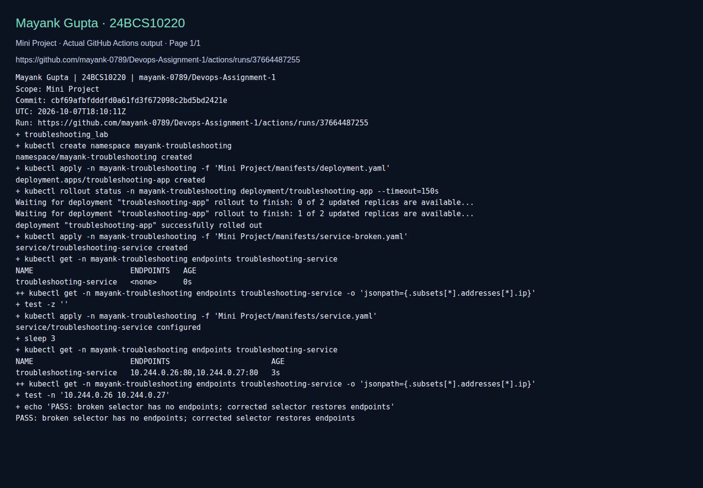

# Kubernetes Troubleshooting (Session 14 mini project)

> Adapted lab walkthrough for Mayank Gupta (24BCS10220). Commands and output blocks below are reference examples from the source material, not a claim that this machine ran them. Imported screenshots were omitted. See [source provenance](../SOURCE.md).


**Name:** Mayank Gupta
**Roll No:** 24BCS10220
**Course:** SST DevOps & Cloud [SWE]

The question this project answers: *"My Kubernetes application is not working. How do I find out why?"*

The source reference environment was a minikube cluster (v1.37.0) and fresh screenshots are linked in the validation section below.

## Folder structure

```
Mini Project/
├── manifests/
│   ├── deployment.yaml        # troubleshooting-app: 2 nginx replicas
│   ├── service.yaml           # troubleshooting-service, selector app=troubleshooting-app
│   ├── service-broken.yaml    # same Service with selector app=wrong-app
│   ├── broken-pod.yaml        # project-broken-pod with a typo in the image tag
│   └── fixed-pod.yaml         # the same Pod with the tag corrected
├── screenshots/
└── README.md
```

## The mindset

Do not guess. Walk the ladder, top to bottom:

```
kubectl get        what is the status?
kubectl describe   what does Kubernetes know about it?
events             what did Kubernetes try to do?
kubectl logs       what does the application say?
kubectl exec       what does it look like from inside?
test connectivity  does the Service reach the Pod? does DNS resolve?
root cause -> fix -> verify
```

---

## Part 1: the five commands, one by one

### 1. `kubectl get`: quick status

```bash
kubectl create deployment web --image=nginx:1.27-alpine
kubectl get pods
kubectl get pods -o wide        # adds Pod IP and node
kubectl get deployment
```


### 2. `kubectl describe`: the details

```bash
kubectl describe pod <web-pod>
```

Labels, node, IP, image, container state, restart count, conditions and, at the bottom, the events for that object.


### 3. `kubectl logs`: what the app says

```bash
kubectl logs <web-pod>
```


### 4. `kubectl exec`: look from inside

```bash
kubectl exec -it <web-pod> -- sh
# hostname; ls /usr/share/nginx/html; head -3 /etc/os-release; curl -s localhost
```

From inside the container nginx answers on localhost, which rules out the app itself when something else is broken.


### 5. Events: what Kubernetes tried

```bash
kubectl get events --sort-by=.lastTimestamp
```


---

## Part 2: the classic failures

### 6. CrashLoopBackOff

```bash
kubectl run crashloop --image=busybox:1.36 -- /bin/sh -c "echo starting; sleep 3; echo crashing now; exit 1"
kubectl get pod crashloop
kubectl logs crashloop
kubectl describe pod crashloop
```

The container prints two lines and exits 1. The restart counter climbs (3 restarts in 50 seconds), `describe` shows `Exit Code: 1` and the `Back-off restarting failed container` event, and the logs tell me exactly what the app printed before it died. On this Kubernetes version the STATUS column reads `Error` between restarts; the back-off is visible in the events.


### 7. ImagePullBackOff

```bash
kubectl run imagepull --image=this-image-does-not-exist:v1
kubectl describe pod imagepull
```

Events spell it out: `pull access denied, repository does not exist`. The Pod object is fine; the kubelet just cannot get the image.


### 8. Pending

```bash
kubectl run pending-pod --image=nginx:1.27-alpine --overrides='{"spec":{"containers":[{"name":"pending-pod","image":"nginx:1.27-alpine","resources":{"requests":{"cpu":"100"}}}]}}'
kubectl describe pod pending-pod
```

A request for 100 CPUs on a one-node laptop cluster: `FailedScheduling ... 1 Insufficient cpu`. The scheduler never placed it, so there is no node, no container, no logs. Events are the only place the reason appears.


### 9a. Service

```bash
kubectl expose deployment web --port=80 --name=web-service
kubectl get service web-service
kubectl get endpoints web-service
kubectl describe service web-service
kubectl get pods -l app=web --show-labels
```

The chain to check is always `Pod labels -> Service selector -> Endpoints`. Here the selector `app=web` matches the Pod label, so the endpoint list holds the Pod IP.


### 9b. DNS

```bash
kubectl run dnsutils --image=busybox:1.36 --command -- sleep 3600
kubectl exec dnsutils -- nslookup web-service
kubectl exec dnsutils -- nslookup kubernetes.default.svc.cluster.local
kubectl get pods -n kube-system -l k8s-app=kube-dns
kubectl logs -n kube-system -l k8s-app=kube-dns --tail=4
```

`web-service` resolves to its ClusterIP through CoreDNS, and the CoreDNS log shows the queries arriving.


Cleanup for this part:


---

## Part 3: the troubleshooting challenge

### Deploy and observe

```bash
kubectl apply -f manifests/deployment.yaml -f manifests/service.yaml
kubectl get pods -o wide
kubectl get service
```


Checking the app itself: `describe` says Running and Ready, logs show nginx workers starting, and `curl localhost` from inside the container returns the welcome page.


Checking the Service: selector `app=troubleshooting-app`, target port 80, and two endpoint IPs.


### Break 1: the Pod with the bad image

```bash
kubectl apply -f manifests/broken-pod.yaml
kubectl get pod project-broken-pod
kubectl describe pod project-broken-pod
```


Answers to the challenge questions:

1. **Pod status?** `ImagePullBackOff` (with `ErrImagePull` right after each attempt).
2. **Actual error?** `failed to resolve reference "docker.io/library/nginx:1.27-alpne": not found`.
3. **Which command found it?** `kubectl describe pod project-broken-pod`, the Events section. `kubectl get` only showed the status word.
4. **What is wrong with the image?** The tag is misspelled: `1.27-alpne` instead of `1.27-alpine`. No such tag exists on Docker Hub.
5. **Fix?** Correct the tag and re-apply. `diff broken-pod.yaml fixed-pod.yaml` shows the one-character change; after `kubectl apply -f manifests/fixed-pod.yaml` the Pod pulls the right image and reaches `1/1 Running`.


### Break 2: the Service that selects nothing

```bash
kubectl apply -f manifests/service-broken.yaml       # selector app=wrong-app
kubectl get service troubleshooting-service
kubectl get endpoints troubleshooting-service        # <none>
kubectl get pods --show-labels -l app=troubleshooting-app
kubectl describe service troubleshooting-service | grep Selector
```

The Service still exists and still has a ClusterIP, but its endpoint list is `<none>`: no Pod carries `app=wrong-app`. Comparing the Pod labels with the selector is the whole diagnosis.


Fix: re-apply the correct Service. Endpoints come back immediately and a curl from a throw-away Pod gets the nginx page.


### Troubleshooting table

| Problem | What I saw | Command I used | Root cause | Fix |
| --- | --- | --- | --- | --- |
| Broken Pod | `ImagePullBackOff`, 0/1 | `kubectl describe pod` (Events) | Image tag typo `1.27-alpne` | Correct the tag, re-apply |
| Service problem | Endpoints `<none>`, Pods Running | `kubectl get endpoints`, `kubectl get pods --show-labels`, `describe service` | Selector `app=wrong-app` matches no Pod label | Set selector back to `app=troubleshooting-app` |
| Image problem (Part 2) | `ImagePullBackOff` | `kubectl describe pod` | Repository `this-image-does-not-exist` does not exist | Use a real image name |
| Crash loop (Part 2) | RESTARTS climbing, `Error` | `kubectl logs`, `describe` | Process exits 1 on purpose | Fix the app so it does not exit |
| Pending (Part 2) | `Pending`, no node | `kubectl describe pod` | Requests 100 CPUs | Request what the node can give |

---

## README questions, in my own words

1. **What does `kubectl get` tell us?** The one-line summary of an object: name, status word, ready count, restarts, age. It is the first look, not the explanation.
2. **`get` vs `describe`?** `get` is the headline; `describe` is the full record, including conditions, container state, mounts and the events Kubernetes recorded for that object.
3. **Why `kubectl logs`?** It shows what the application wrote to stdout and stderr. Kubernetes can tell me a container crashed; only the logs tell me why the program decided to.
4. **When `kubectl exec`?** When I need to see the container from inside: is the process listening, is the config file what I expect, can it reach the database. It is the equivalent of SSH into the Pod.
5. **CrashLoopBackOff?** The container keeps exiting and Kubernetes keeps restarting it with a growing delay (10s, 20s, 40s ...). The app is broken or misconfigured; read the logs.
6. **ImagePullBackOff?** The kubelet could not download the image (wrong name, wrong tag, private registry without credentials) and is retrying with back-off. Events hold the exact error.
7. **Why Pending?** The scheduler found no node that fits: not enough CPU or memory, a nodeSelector or taint nobody satisfies, or a PVC that cannot be bound. Events say which.
8. **Why can a Service have no endpoints?** Its selector matches no Pod labels, or the matching Pods are not Ready (readiness probe failing), so nothing is behind it.
9. **Selector and labels?** The Service's selector is a query; every Pod whose labels satisfy it becomes an endpoint. Change either side and the link breaks.
10. **Kubernetes DNS?** CoreDNS, running in `kube-system`, gives every Service a name like `web-service.default.svc.cluster.local` and every Pod a resolver that knows the cluster search domains. If a name does not resolve, check the Service exists and CoreDNS is healthy.

## Final architecture

```
                 troubleshooting-service (ClusterIP :80)
                            │ selector app=troubleshooting-app
              ┌─────────────┴─────────────┐
              ▼                           ▼
   troubleshooting-app Pod 1    troubleshooting-app Pod 2   (nginx:1.27-alpine)
```

## Fresh validation evidence

The following screenshot displays actual CI command output for this adapted lab. It validates only the checks shown, not every reference example above. The raw log and run metadata are saved beside it.



[Raw command output](screenshots/validation.log) · [Run metadata](screenshots/validation.json)
