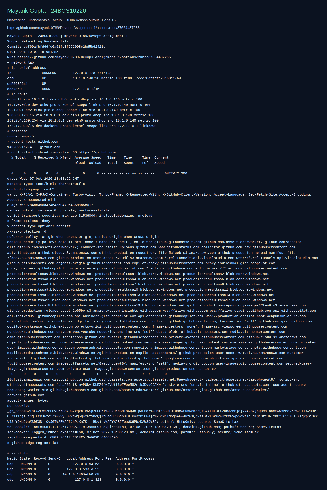

# Networking Fundamentals

**Name:** Mayank Gupta
**Roll No:** 24BCS10220

- [networking](networking.md)

## Fresh validation evidence

The following screenshot displays actual CI command output for this adapted lab. It validates only the checks shown, not every reference example above. The raw log and run metadata are saved beside it.

[Raw command output](screenshots/validation.log) · [Run metadata](screenshots/validation.json)
