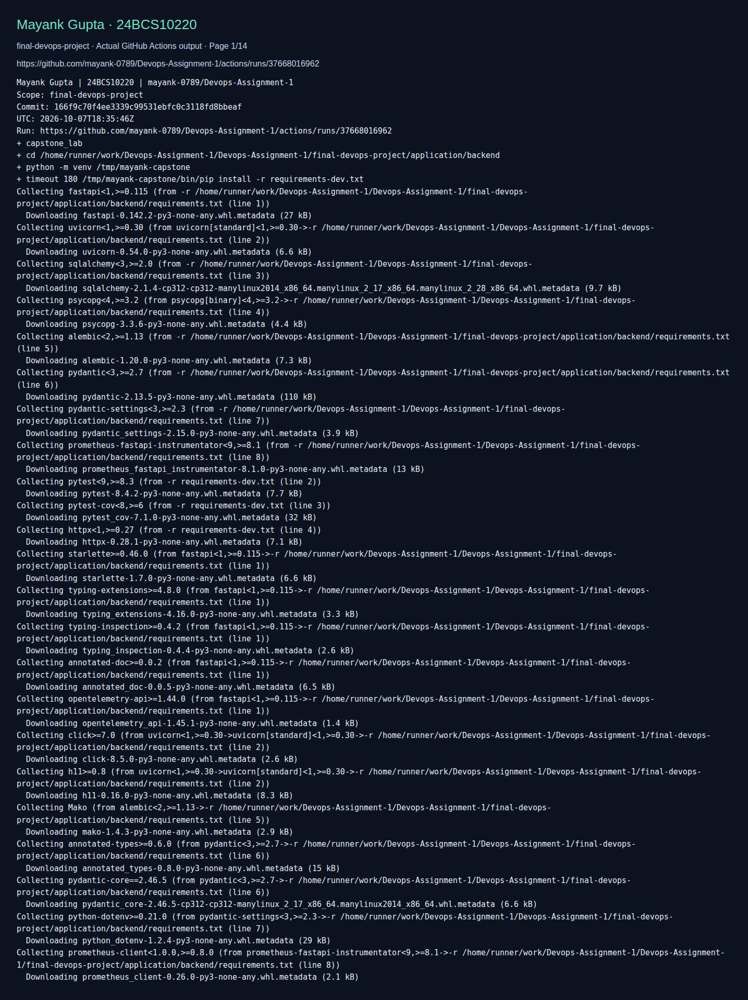
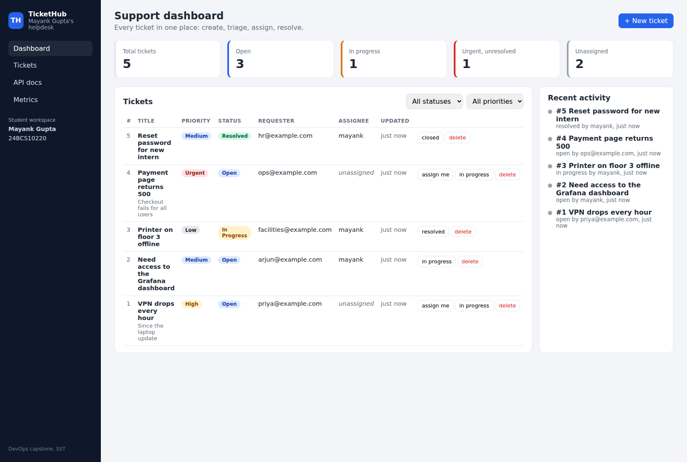
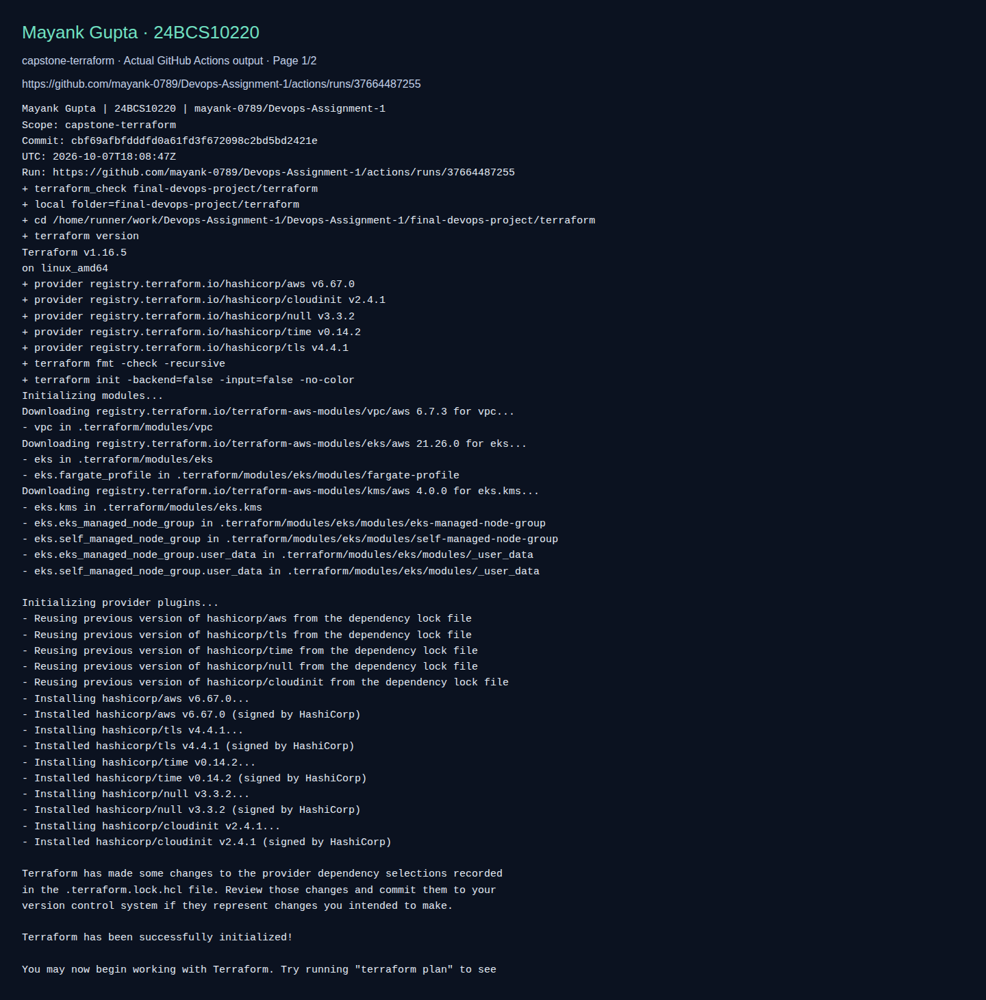

# TicketHub DevOps capstone

**Name:** Mayank Gupta
**Roll No:** 24BCS10220
**Repository:** [mayank-0789/Devops-Assignment-1](https://github.com/mayank-0789/Devops-Assignment-1)

## What this lab contains

Existing API tests, frontend production build and live PostgreSQL/migration/backend/frontend Compose stack with seeded tickets. Infrastructure configuration is validated in the Terraform suite. EKS, HPA and Argo CD deployment remain further exercises.

Top-level resources: `application`, `docker`, `gitops`, `helm`, `kubernetes`, `monitoring`, `scripts`, `terraform`, `troubleshooting`.

[Detailed adapted walkthrough](REFERENCE.md) · [Source provenance](../SOURCE.md) · [Validation scope](../VALIDATION.md)

The walkthrough retains source example commands and outputs for study. Its historical screenshots were omitted. Workflow names and completion claims in that reference describe the source design; the active workflow in this repository is `.github/workflows/validate-labs.yml`.

## Run the lab

Run these commands from this folder. Use a disposable lab environment. Linux commands need a Linux host; Docker commands need a running Docker engine; Kubernetes/Helm commands need a reachable cluster.

```bash
docker compose -f docker/docker-compose.yml up -d --build --wait
bash scripts/seed.sh
# Frontend http://localhost:3000; API docs http://localhost:8000/docs
# Remove disposable lab containers and database when finished:
docker compose -f docker/docker-compose.yml down -v
```

## Fresh execution evidence

The **capstone** job in [Validate Mayank DevOps labs](https://github.com/mayank-0789/Devops-Assignment-1/actions/workflows/validate-labs.yml) executes the scope above. The screenshot shows actual recorded CI commands/output; it proves only those checks.



[All screenshot pages](screenshots/) · [Full raw command output](screenshots/validation.log) · [Commit and run metadata](screenshots/validation.json)

### Running application



## Infrastructure configuration validation

The Terraform job initialized the VPC/EKS modules and validated their configuration without creating cloud resources.



[Terraform log](terraform/screenshots/validation.log) · [Run metadata](terraform/screenshots/validation.json)
