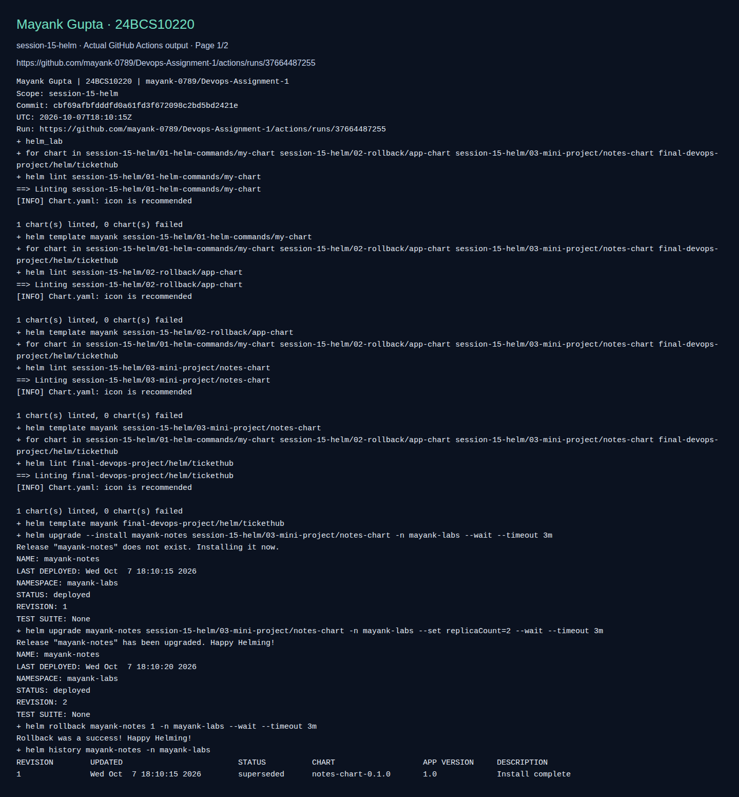

# Session 15: Helm

> Adapted lab walkthrough for Mayank Gupta (24BCS10220). Commands and output blocks below are reference examples from the source material, not a claim that this machine ran them. Imported screenshots were omitted. See [source provenance](../SOURCE.md).


**Name:** Mayank Gupta
**Roll No:** 24BCS10220
**Course:** SST DevOps & Cloud [SWE]
**Session:** 15

Helm is the package manager for Kubernetes. The vocabulary I use below:

- **Chart**: a folder of templated manifests plus defaults. The recipe.
- **Values**: the settings that fill the templates. The ingredients.
- **Release**: one installed copy of a chart in a cluster. The cooked meal.
- **Revision**: a numbered snapshot of a release. Install, every upgrade and every rollback add one.

Source reference environment: minikube cluster with Helm v4.3.0; fresh screenshots are linked in the validation section below.

## Folder structure

```
session-15-helm/
├── 01-helm-commands/my-chart/        # generated live with `helm create` in Task 1
├── 02-rollback/app-chart/            # Chart.yaml, values.yaml, templates/deployment.yaml
├── 03-mini-project/notes-chart/      # Chart.yaml, values.yaml, values-prod.yaml, templates/{configmap,deployment,service}.yaml
├── screenshots/
└── README.md
```

---

## Task 1: the Helm commands

| Command | What it does | Shown in |
| --- | --- | --- |
| `helm create` | Generates a chart skeleton | 1.1 |
| `helm lint` | Checks a chart for mistakes | 1.2 |
| `helm template` | Renders the YAML locally, touches nothing | 1.2 |
| `helm install` | Installs a chart as a release | 1.3 |
| `helm list` | Lists releases | 1.3 |
| `helm status` | Shows one release | 1.4 |
| `helm get values` / `manifest` | Shows what a release was built from | 1.4 |
| `helm uninstall` | Removes a release and its objects | 1.5 |
| `helm repo` | Manages chart repositories | 1.6 |
| `helm search` | Finds charts in repos or on Artifact Hub | 1.7 |
| `helm upgrade`, `history`, `rollback` | Change, inspect, revert a release | Task 2 |

### 1.1 helm create

```bash
cd 01-helm-commands
helm version
helm create my-chart
find my-chart -type f | sort
```

`helm create` writes a working nginx chart: `Chart.yaml`, `values.yaml`, helpers, and templates for a Deployment, Service, ServiceAccount, Ingress, HTTPRoute, HPA and a connection test.


### 1.2 lint and template

```bash
helm lint my-chart
helm template my-release my-chart | head -40
```

`helm template` shows the exact YAML Helm would send, with `{{ .Release.Name }}` already replaced by `my-release`. Nothing reaches the cluster.


### 1.3 install and list

```bash
helm install my-release ./my-chart
helm list
kubectl get pods,svc
```


### 1.4 status and get

```bash
helm status my-release
helm get values my-release --all | head -20
helm get manifest my-release | head -40
```


### 1.5 uninstall


### 1.6 repo

```bash
helm repo add bitnami https://charts.bitnami.com/bitnami
helm repo list
helm repo update
```


### 1.7 search

```bash
helm search repo nginx
helm search hub nginx | head -10
helm show chart bitnami/nginx
```

`search repo` looks only in repositories I added; `search hub` queries the public Artifact Hub.


---

## Task 2: upgrade and rollback

`app-chart` deploys `{{ .Release.Name }}-app`, one replica of `nginx:1.24` by default.

### 2.1 Install: revision 1

```bash
helm install web-app ./02-rollback/app-chart
kubectl get deploy web-app-app -o wide
```


### 2.2 Upgrade: revision 2, three replicas

```bash
helm upgrade web-app ./02-rollback/app-chart --set replicaCount=3
kubectl rollout status deploy/web-app-app
```


### 2.3 A bad upgrade: revision 3

```bash
helm upgrade web-app ./02-rollback/app-chart --reuse-values --set image.tag=doesnotexist
kubectl get pods
helm status web-app
```

Helm says `deployed`, because its job ended when the YAML was accepted. Kubernetes tells the truth: one new Pod in `ImagePullBackOff` and the three old Pods still Running, because the rolling update will not remove healthy Pods until replacements are Ready. The app never went down. `--reuse-values` is what kept the three replicas from revision 2.


### 2.4 History and rollback: revision 4

```bash
helm history web-app
helm rollback web-app 2
helm history web-app
kubectl get deploy web-app-app -o wide
```


Rollback does not erase anything: revision 4 appears with the description `Rollback to 2`, the Deployment is back on `nginx:1.24` with three replicas, and the broken Pod is terminated.


---

## Task 3: Mayank's Notes App chart

`notes-chart` packages an nginx Deployment, a ConfigMap with `APP_NAME` and `ENVIRONMENT`, and a NodePort Service.

| Key | values.yaml | values-prod.yaml |
| --- | --- | --- |
| replicaCount | 1 | 3 |
| image.tag | 1.24 | 1.25 |
| service.nodePort | 30090 | 30090 |
| app.name | mayank-notes-app | mayank-notes-app |
| app.environment | development | production |

The Deployment loads the ConfigMap with `envFrom`, so the values show up as environment variables inside the container.

### 3.1 Lint and render


### 3.2 Install the development release

```bash
helm install notes-dev ./03-mini-project/notes-chart
kubectl get pods,services,configmaps
```


### 3.3 Verify

```bash
kubectl exec deploy/notes-dev-deploy -- env | grep -E "APP_NAME|ENVIRONMENT"
kubectl port-forward svc/notes-dev-svc 8080:80
curl -s http://localhost:8080 | head -5
```

`APP_NAME=mayank-notes-app`, `ENVIRONMENT=development`, and nginx answers through the Service.


### 3.4 Upgrade with production values: revision 2

```bash
helm upgrade notes-dev ./03-mini-project/notes-chart -f ./03-mini-project/notes-chart/values-prod.yaml
```

Three Pods, `ENVIRONMENT=production`.


### 3.5 History and values per revision

```bash
helm history notes-dev
helm get values notes-dev
helm get values notes-dev --revision 1
```

Revision 2 lists the production overrides; revision 1 shows `null`, meaning I passed no user values at install time and the chart defaults applied.


### 3.6 Bad upgrade and 3.7 rollback

```bash
helm upgrade notes-dev ./03-mini-project/notes-chart -f ./03-mini-project/notes-chart/values-prod.yaml --set image.tag=broken-tag-does-not-exist
kubectl get pods                      # new Pod in ErrImagePull / ImagePullBackOff
helm rollback notes-dev 2
helm history notes-dev                # revision 4: Rollback to 2
```


### 3.8 Uninstall


---

## What I took away

- `helm lint` and `helm template` catch most mistakes before anything is installed.
- Values precedence: chart `values.yaml`, then `-f` files, then `--set`, last one wins. `helm upgrade` without `-f` or `--reuse-values` silently falls back to the chart defaults.
- Helm marks a release `deployed` once the API accepted the YAML. Always look at the Pods too.
- Every change, including a rollback, is a new revision, so the history is never lost.
- `helm upgrade --install` is the one command pipelines use; the final project's workflow does exactly that.

## Fresh validation evidence

The following screenshot displays actual CI command output for this adapted lab. It validates only the checks shown, not every reference example above. The raw log and run metadata are saved beside it.



[Raw command output](screenshots/validation.log) · [Run metadata](screenshots/validation.json)
