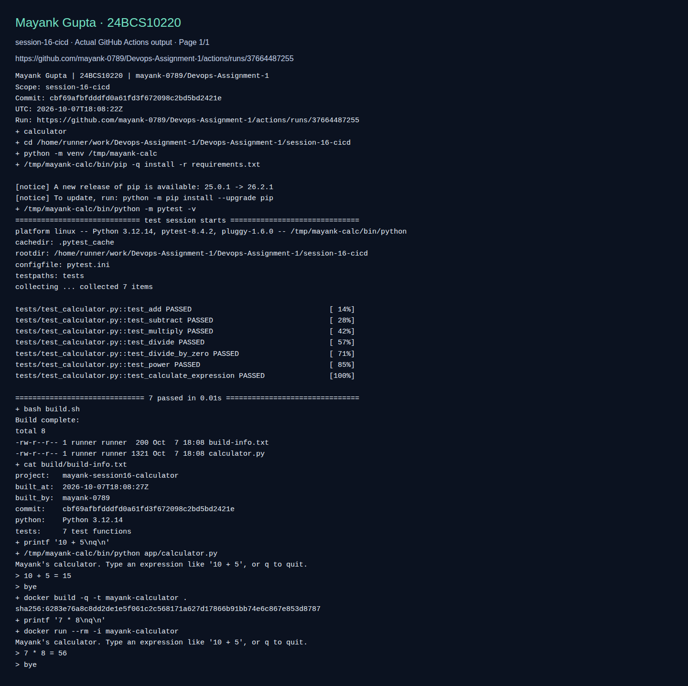

# Calculator with CI/CD validation

**Name:** Mayank Gupta
**Roll No:** 24BCS10220
**Repository:** [mayank-0789/Devops-Assignment-1](https://github.com/mayank-0789/Devops-Assignment-1)

## What this lab contains

Seven existing calculator tests, build metadata, CLI execution and Docker image smoke test. The actual workflow is validate-labs.yml; registry delivery is not enabled.

Top-level resources: `Dockerfile`, `app`, `build.sh`, `pytest.ini`, `requirements.txt`, `tests`.

[Detailed adapted walkthrough](REFERENCE.md) · [Source provenance](../SOURCE.md) · [Validation scope](../VALIDATION.md)

The walkthrough retains source example commands and outputs for study. Its historical screenshots were omitted. Workflow names and completion claims in that reference describe the source design; the active workflow in this repository is `.github/workflows/validate-labs.yml`.

## Run the lab

Run these commands from this folder. Use a disposable lab environment. Linux commands need a Linux host; Docker commands need a running Docker engine; Kubernetes/Helm commands need a reachable cluster.

```bash
python3 -m venv .venv
. .venv/bin/activate
pip install -r requirements.txt
python -m pytest -v
bash build.sh
printf "10 + 5\nq\n" | python app/calculator.py
```

## Fresh execution evidence

The **apps** job in [Validate Mayank DevOps labs](https://github.com/mayank-0789/Devops-Assignment-1/actions/workflows/validate-labs.yml) executes the scope above. The screenshot shows actual recorded CI commands/output; it proves only those checks.



[All screenshot pages](screenshots/) · [Full raw command output](screenshots/validation.log) · [Commit and run metadata](screenshots/validation.json)
