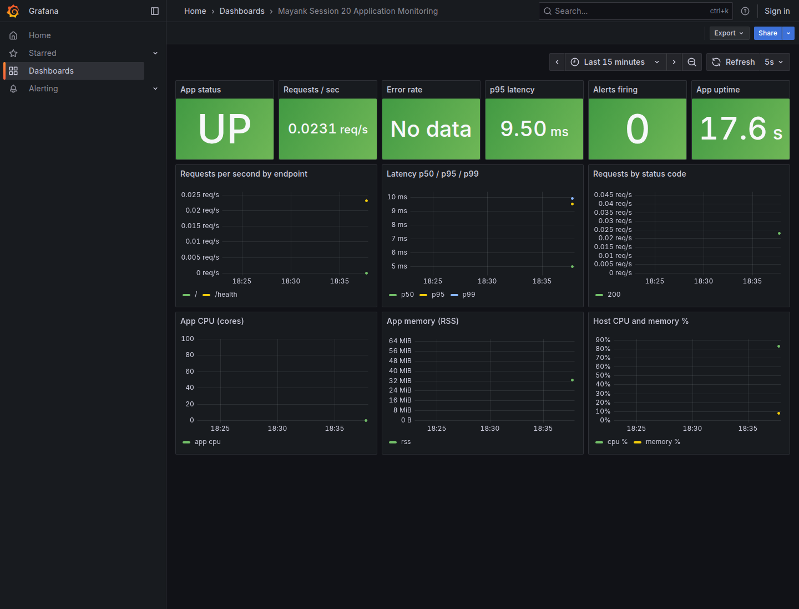

# Monitoring, observability and GitOps

**Name:** Mayank Gupta
**Roll No:** 24BCS10220
**Repository:** [mayank-0789/Devops-Assignment-1](https://github.com/mayank-0789/Devops-Assignment-1)

## What this lab contains

Live Flask metrics, Prometheus query and Grafana health/dashboard via Docker Compose. GitOps manifests point to this repository; Argo CD synchronization is a separate exercise.

Top-level resources: `01-monitoring`, `02-observability`, `03-gitops`.

[Detailed adapted walkthrough](REFERENCE.md) · [Source provenance](../SOURCE.md) · [Validation scope](../VALIDATION.md)

The walkthrough retains source example commands and outputs for study. Its historical screenshots were omitted. Workflow names and completion claims in that reference describe the source design; the active workflow in this repository is `.github/workflows/validate-labs.yml`.

## Run the lab

Run these commands from this folder. Use a disposable lab environment. Linux commands need a Linux host; Docker commands need a running Docker engine; Kubernetes/Helm commands need a reachable cluster.

```bash
docker compose -f 01-monitoring/docker-compose.yml up -d --build
# App http://localhost:8000; Prometheus :9090; Grafana :3000
# Grafana demo login: admin / admin
docker compose -f 01-monitoring/docker-compose.yml down -v
```

## Fresh execution evidence

The **capstone** job in [Validate Mayank DevOps labs](https://github.com/mayank-0789/Devops-Assignment-1/actions/workflows/validate-labs.yml) executes the scope above. The screenshot shows actual recorded CI commands/output; it proves only those checks.


[All screenshot pages](screenshots/) · [Full raw command output](screenshots/validation.log) · [Commit and run metadata](screenshots/validation.json)

### Running application


