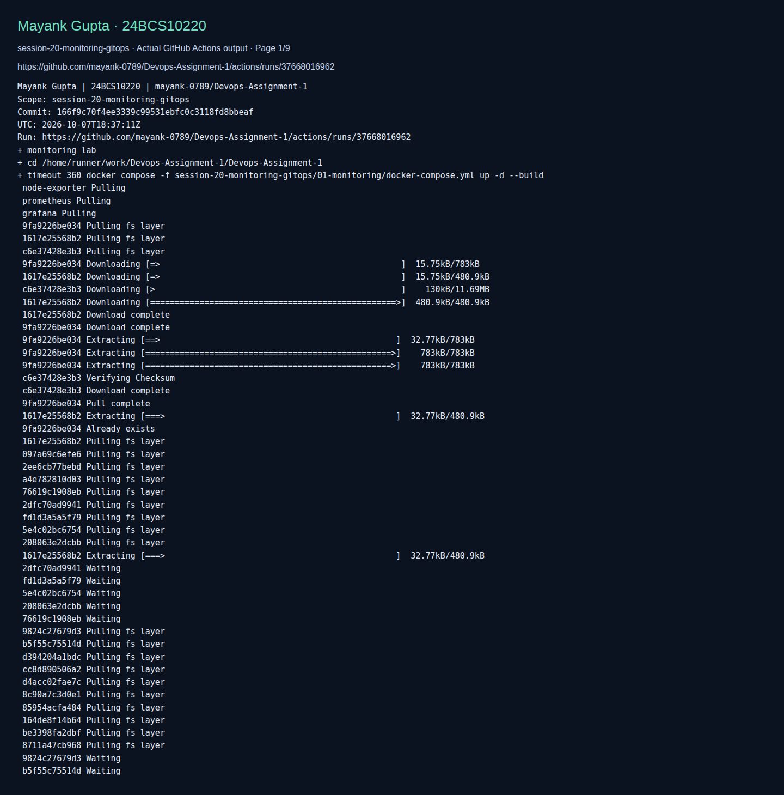

# Session 20: Monitoring, Observability and GitOps

> Adapted lab walkthrough for Mayank Gupta (24BCS10220). Commands and output blocks below are reference examples from the source material, not a claim that this machine ran them. Imported screenshots were omitted. See [source provenance](../SOURCE.md).


**Name:** Mayank Gupta
**Roll No:** 24BCS10220
**Course:** SST DevOps & Cloud [SWE]
**Session:** 20

| Task | Folder | What it holds |
| --- | --- | --- |
| 1. Monitoring | [01-monitoring](01-monitoring/README.md) | A working Prometheus + Grafana stack around a small Flask app: metrics, logs, five alert rules, CPU and memory, app health, and what each looks like healthy, overloaded and down. 17 screenshots. |
| 2. Observability | [02-observability](02-observability/README.md) | Metrics, logs and traces; monitoring versus observability; tools; observability in Kubernetes. |
| 3. GitOps | [03-gitops](03-gitops/README.md) | What GitOps is, plus an Argo CD application for this repository with sync, self-heal and Git rollback. |

## Quick start

```bash
# Task 1
cd session-20-monitoring-gitops/01-monitoring
docker compose up -d --build
./load.sh normal 60
# Prometheus http://localhost:9090   Grafana http://localhost:3000 (admin / admin)
docker compose down -v

# Task 3 (after the folder is on GitHub)
kubectl config use-context kind-session20
kubectl apply -f session-20-monitoring-gitops/03-gitops/argocd-application.yaml
kubectl get applications -n argocd -w
```

## Fresh validation evidence

The following screenshot displays actual CI command output for this adapted lab. It validates only the checks shown, not every reference example above. The raw log and run metadata are saved beside it.



[Raw command output](screenshots/validation.log) · [Run metadata](screenshots/validation.json)
